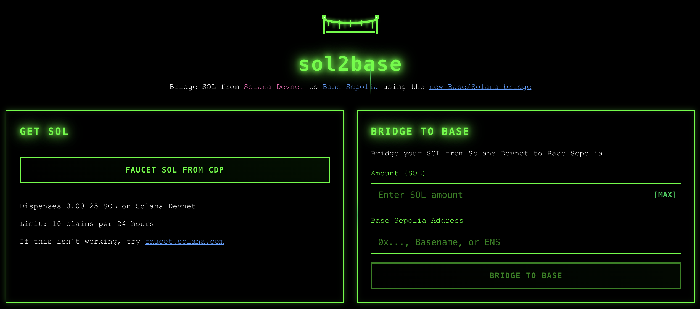

# sol2base

<div align="center">
  
</div>

<div align="center">
  <h3>A Solana to Base bridge application that enables seamless SOL transfers from Solana Devnet to Base Sepolia testnet.</h3>
</div>

<div align="center">
  
  

</div>

## 🌉 Features

- **Real Bridge Functionality**: Actual SOL bridging from Solana Devnet to Base Sepolia
- **CDP Faucet Integration**: Get SOL directly from Coinbase Developer Platform
- **Address Resolution**: Support for ENS names and Basenames
- **Hacker Theme**: Dark green-on-black aesthetic with matrix rain animations
- **Real-time Balance**: Live SOL balance tracking
- **Transaction Status**: Complete transaction history and status monitoring
- **Responsive Design**: Clean, modern interface that works on all devices

## 🚀 Quick Start

### Prerequisites

- Node.js 18+ 
- npm or yarn
- A Solana wallet (Phantom, Solflare)

### Installation

1. Clone the repository:
```bash
git clone https://github.com/Jnix2007/sol2base.git
cd sol2base
```

2. Install dependencies:
```bash
npm install --legacy-peer-deps
```

3. Copy environment template:
```bash
cp env.template .env.local
```

4. (Optional) Add CDP API credentials to `.env.local` for real faucet functionality:
```env
CDP_API_KEY_ID=your_cdp_api_key_id
CDP_API_KEY_SECRET=your_cdp_api_key_secret
CDP_WALLET_SECRET=your_cdp_wallet_secret
```

5. Start the development server:
```bash
npm run dev
```

6. Open [http://localhost:3000](http://localhost:3000) in your browser

## 🔧 How It Works

### Bridge Process

1. **Connect Wallet**: Connect your Solana wallet (Phantom/Solflare)
2. **Get SOL**: Use the integrated CDP faucet to get SOL on Solana Devnet
3. **Enter Details**: Specify amount and destination (Base Sepolia address, ENS, or Basename)
4. **Bridge**: Execute the bridge transaction
5. **Monitor**: Track your transaction status in real-time

### Technical Architecture

- **Frontend**: Next.js 15 with TypeScript and Tailwind CSS
- **Solana Integration**: Uses `@solana/wallet-adapter` and `@solana/web3.js`
- **Bridge Contracts**: Real Base/Solana bridge smart contracts
- **Address Resolution**: ENS and Basename support via ethers.js
- **Faucet**: CDP (Coinbase Developer Platform) integration

## 🎨 UI Theme

The application features a distinctive "hacker" aesthetic:
- **Colors**: Bright green (#00ff00) on black background
- **Typography**: JetBrains Mono and Orbitron fonts
- **Animations**: Matrix rain effects and glowing text
- **Logo**: Pixelated suspension bridge with animated effects

## 📱 Components

- **Faucet Section**: Get SOL from CDP with rate limiting info
- **Bridge Form**: Input validation and address resolution
- **Balance Display**: Real-time SOL balance tracking  
- **Transaction History**: Complete status tracking
- **Wallet Integration**: Seamless wallet connection

## 🔗 Networks

- **Source**: Solana Devnet
- **Destination**: Base Sepolia Testnet
- **Faucet**: CDP Solana Devnet SOL Faucet
- **Backup Faucet**: [faucet.solana.com](https://faucet.solana.com)

## 🛠️ Development

### Project Structure

```
sol2base/
├── src/
│   ├── app/                 # Next.js app router
│   ├── components/          # React components
│   ├── lib/                 # Utilities and services
│   └── styles/              # Global styles
├── bridge-contracts/        # Base bridge contracts
├── bridge-solana/          # Solana bridge programs
└── public/                 # Static assets
```

### Key Files

- `src/lib/bridge.ts` - Main bridge service
- `src/lib/realBridgeImplementation.ts` - Real bridge transaction logic
- `src/lib/cdpFaucet.ts` - CDP faucet integration
- `src/lib/addressResolver.ts` - ENS/Basename resolution
- `src/components/MainContent.tsx` - Main application interface

## 🔐 Security

- **No Private Keys**: Uses wallet adapter for secure signing
- **Address Validation**: Validates all addresses before transactions
- **Error Handling**: Comprehensive error handling and user feedback
- **Rate Limiting**: Respects faucet rate limits

## 🤝 Contributing

1. Fork the repository
2. Create a feature branch: `git checkout -b feature/amazing-feature`
3. Commit your changes: `git commit -m 'Add amazing feature'`
4. Push to the branch: `git push origin feature/amazing-feature`
5. Open a Pull Request

## 📄 License

This project is licensed under the MIT License - see the [LICENSE](LICENSE) file for details.

## 🙏 Acknowledgments

- [Base](https://base.org) for the bridge infrastructure
- [Coinbase Developer Platform](https://docs.cdp.coinbase.com) for faucet services
- [Solana](https://solana.com) for the blockchain infrastructure
- The open-source community for the amazing tools and libraries

## 🔗 Links

- **Live Demo**: [Coming Soon]
- **Base Bridge Docs**: [github.com/base/bridge](https://github.com/base/bridge)
- **Solana Docs**: [docs.solana.com](https://docs.solana.com)
- **CDP Docs**: [docs.cdp.coinbase.com](https://docs.cdp.coinbase.com)

---

**"Base is a bridge, not an island"** 🌉